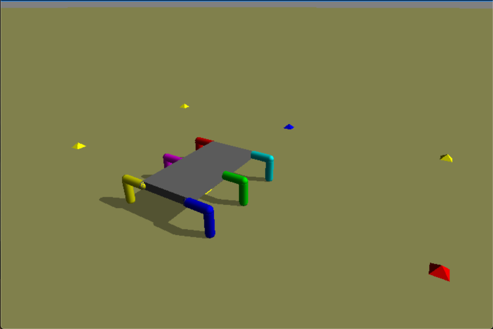
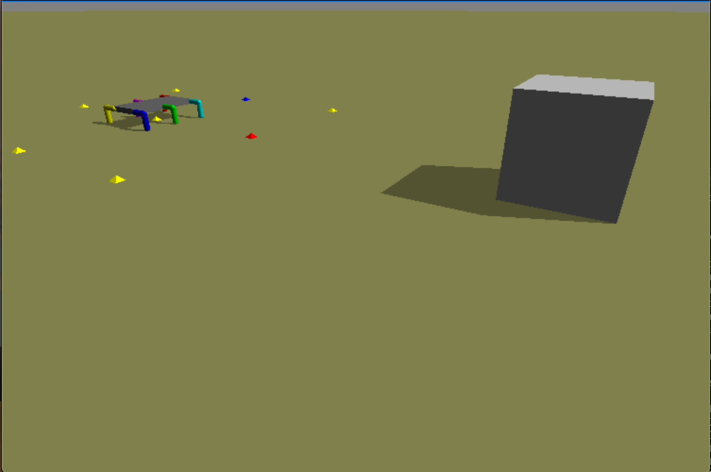

# my_thesisBot

The current version consists of:
- a physical simulator
- a structurally modular CTRNN as the controllor
- a simple genetic algorithm

## prerequisites

Before you run the demo, please make sure to have python3 and `pyroSim` library. The current setup only shows the raw simulator
with random NN weights. If you wish to see some interesting behaviors, please go to `constants.py` and change `numGens` to 200,
and wait out the evolution.

## run demo
```bash
$ python3 main.py
```
This will generate 4 windows, each with the objective light source at a different direction to the robot, and the robot is evolved
to walk towards the light source, as shown:
# 
# 
Left click on the windows and drag to rotate the camera; right click and drag to pull the camera further or closer; ctrl+p to pause/resume.
